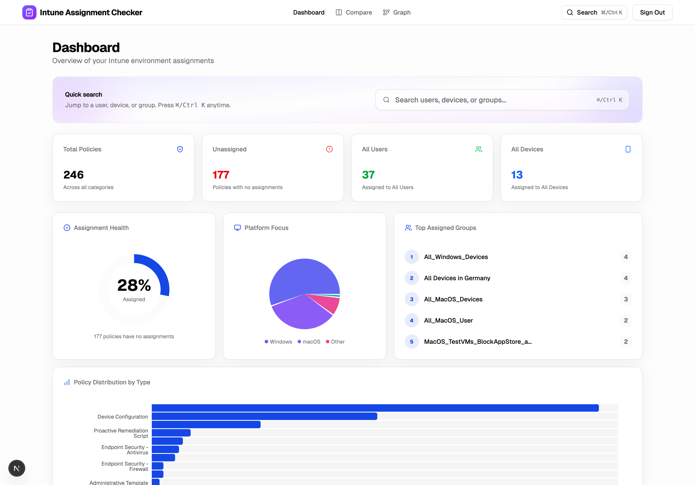
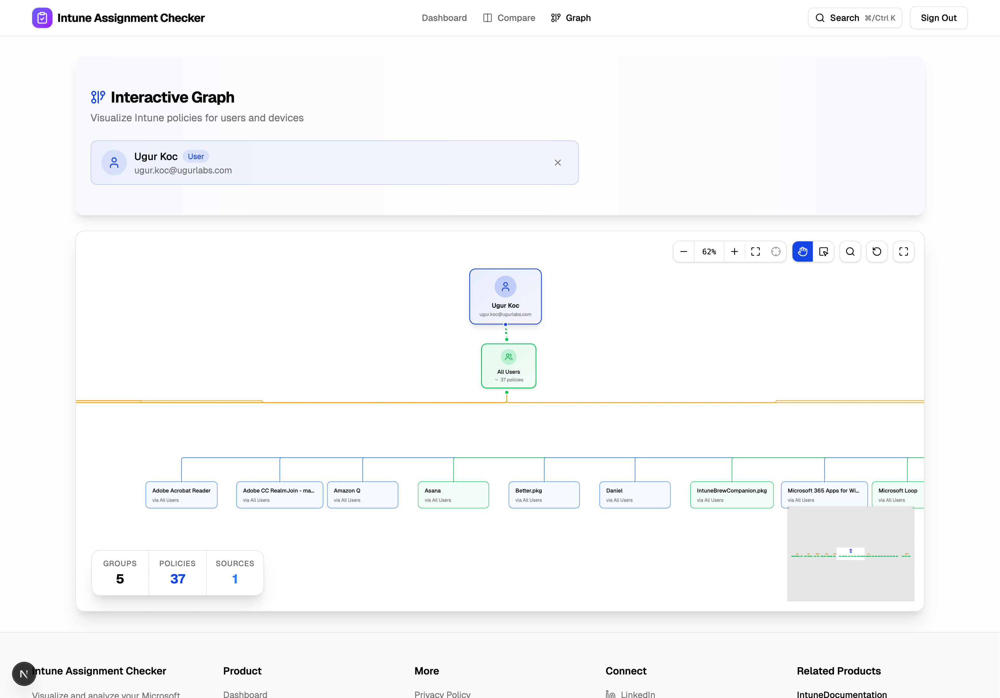
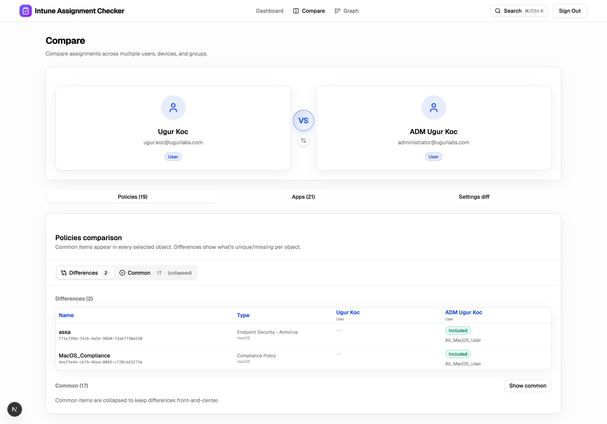

# Intune Assignment Checker

A web application for Intune administrators to visualize, audit, and manage Microsoft Intune policy assignments. This tool helps identify unassigned policies and visualizes relationships between users, groups, and policies.

<p align="center">
  
</p>

<table>
  <tr>
    <td width="50%">
      <p><strong>Assignment Explorer</strong></p>
      
    </td>
    <td width="50%">
      <p><strong>Compare</strong></p>
      
    </td>
  </tr>
</table>

## Features

### Dashboard

- **Overview Stats**: View total policy count, unassigned policies, and global assignments.
- **Policy Insights**: Breakdowns of policy distribution by platform, type, and assignment status.
- **Inventory**: Searchable and filterable table of all Intune policies (Device Config, Compliance, Endpoint Security, Apps, Scripts, etc.).
- **Drift Detection**: Identify policies that are not assigned to any group.

### User Policy Assignments

- **Graph Visualization**: View the relationship between a user, their group memberships, and inherited policies.
- **Search**: Search for users in the directory to audit their policy landscape.
- **Visualization**: Explore connections using a node-based graph.

### Tech Stack

- **Framework**: [Next.js 15](https://nextjs.org/) (App Router)
- **Styling**: [Tailwind CSS](https://tailwindcss.com/) & [Radix UI](https://www.radix-ui.com/)
- **Authentication**: [MSAL React](https://github.com/AzureAD/microsoft-authentication-library-for-js/tree/dev/lib/msal-react) (Entra ID)
- **Data**: Microsoft Graph API
- **Visualization**: [Recharts](https://recharts.org/) & [React Flow](https://reactflow.dev/)
- **State Management**: [TanStack Query](https://tanstack.com/query/latest)

## Prerequisites

Ensure you have the following:

- **Node.js** (v18 or higher)
- **npm** or **pnpm**
- An **Entra ID Tenant** with administrative access to create App Registrations.

## Getting Started

This section is for people that want to host this project on their own. For everyone else, you can audit the code here and use the website at [IntuneAssignmentChecker.com](https://IntuneAssignmentChecker.com).

### 1. Clone the Repository

```bash
git clone https://github.com/ugurkocde/intuneassignments-website.git
cd intuneassignments-website
```

### 2. Install Dependencies

```bash
npm install
# or
pnpm install
```

### 3. Entra ID Setup

Register an application in the Azure Portal (or Entra admin center) to allow authentication and Graph API access.

1. Go to [Azure Portal > App registrations](https://portal.azure.com/#view/Microsoft_AAD_IAM/ActiveDirectoryMenuBlade/RegisteredApps).
2. Click **New registration**.
   - Name: `Intune Assignments Visualizer`
   - Supported account types: `Accounts in this organizational directory only` (Single Tenant)
   - Redirect URI (SPA): `http://localhost:3000/`
3. Note down the **Application (client) ID** and **Directory (tenant) ID**.
4. Go to **API Permissions** and add the following **Delegated** permissions for **Microsoft Graph**:
   - `User.Read`
   - `User.Read.All`
   - `GroupMember.Read.All`
   - `DeviceManagementManagedDevices.Read.All`
   - `DeviceManagementApps.Read.All`
   - `DeviceManagementConfiguration.Read.All`
   - `DeviceManagementServiceConfig.Read.All`
   - `CloudPC.Read.All`
5. Click **Grant admin consent** for your tenant.

### 4. Configure Environment Variables

Create a `.env` file in the root directory based on the `.env.example` (if available) or use the following template:

```env
# Entra ID Configuration
NEXT_PUBLIC_AZURE_AD_CLIENT_ID=your-client-id-here
NEXT_PUBLIC_AZURE_AD_TENANT_ID=your-tenant-id-here
```

### 5. Run the Development Server

```bash
npm run dev
# or
pnpm dev
```

Open [http://localhost:3000](http://localhost:3000) with your browser to see the application.

## Contributing

Contributions are welcome. Please feel free to submit a Pull Request.

1. Fork the project
2. Create your feature branch (`git checkout -b feature/AmazingFeature`)
3. Commit your changes (`git commit -m 'Add some AmazingFeature'`)
4. Push to the branch (`git push origin feature/AmazingFeature`)
5. Open a Pull Request

## License

This project is licensed under the MIT License - see the [LICENSE](LICENSE) file for details.

---

Built using the [T3 Stack](https://create.t3.gg/).
